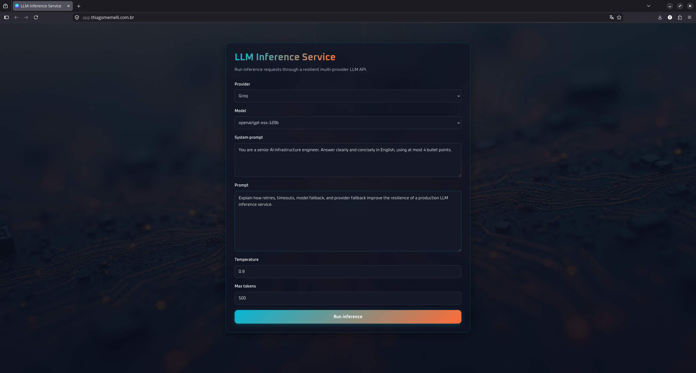
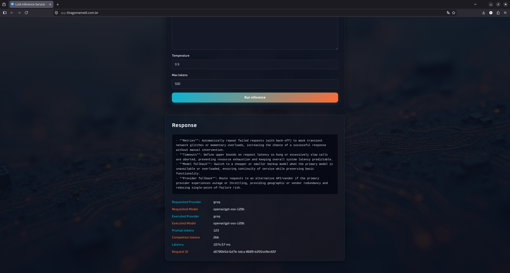
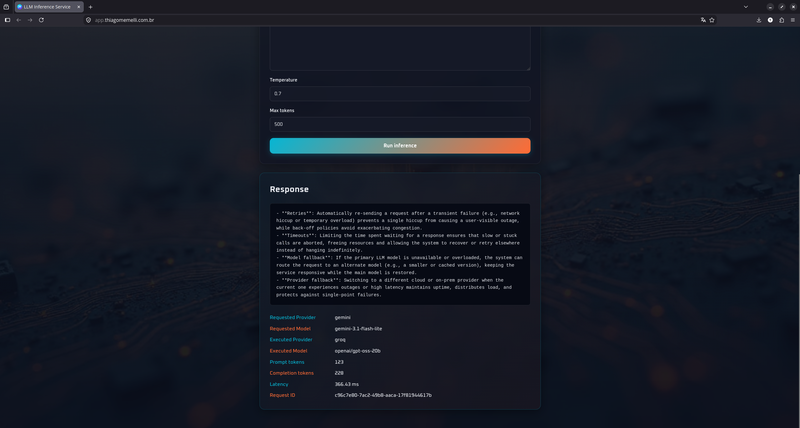

<div align="center">

# ⚡ LLM Inference Service

### Resilient Multi-Provider LLM Inference API with Async Python, Fallback Routing, Concurrency Control, and Production Deployment

<br>


<br>

**A production-oriented LLM inference service that exposes one stable API across multiple AI providers while centralizing resilience, concurrency, validation, rate limiting, and provider-specific error handling.**

### 🌐 Live

[**Live Application**](https://app.thiagomemelli.com.br) •
[**API Documentation**](https://api.thiagomemelli.com.br/docs) •
[**Health Check**](https://api.thiagomemelli.com.br/health) •
[**Portfolio**](https://thiagomemelli.com.br)

<br>

[Why This Project Exists](#-why-this-project-exists) •
[Demo](#️-live-demo) •
[Features](#-features) •
[Architecture](#️-architecture) •
[API](#-api) •
[Quick Start](#-quick-start) •
[Testing](#-testing--quality) •
[Engineering Decisions](#-engineering-decisions)

</div>

---

## 💡 Why this project exists

Calling an LLM provider directly is easy. Operating an application that depends on LLMs reliably is a different problem.

Once an application relies on external model providers, it must deal with concerns such as:

- transient network failures;
- provider timeouts;
- upstream rate limits;
- temporary provider outages;
- model-level failures;
- provider-level failures;
- provider-specific SDK exceptions;
- concurrency pressure;
- request validation;
- public API abuse;
- observability across retries and fallbacks.

If those concerns are scattered across endpoint handlers or provider SDK calls, the application quickly becomes hard to reason about and difficult to extend.

**LLM Inference Service** centralizes that behavior behind one asynchronous HTTP API.

The API accepts a provider, model, prompt, and inference parameters. From that point forward, the service owns the execution policy: concurrency limits, timeout enforcement, retries, model fallback, provider fallback, error normalization, and response metadata.

---

## 🚀 What it does

A client sends one inference request:

```text
POST /v1/inference
        │
        ▼
┌──────────────────────┐
│ FastAPI HTTP Layer   │
│ • schema validation  │
│ • per-client limit   │
└──────────┬───────────┘
           │
           ▼
┌──────────────────────┐
│  InferenceService    │
│  orchestration       │
└──────────┬───────────┘
           │
           ├── provider semaphore
           ├── timeout
           ├── retry + backoff + jitter
           ├── model fallback
           └── provider fallback
           │
           ▼
┌──────────────────────┐
│  ProviderRegistry    │
└──────────┬───────────┘
           │
     ┌─────┴─────┐
     ▼           ▼
┌─────────┐  ┌─────────┐
│  Groq   │  │ Gemini  │
│ Adapter │  │ Adapter │
└────┬────┘  └────┬────┘
     │            │
     ▼            ▼
 Groq API     Google GenAI
     │            │
     └─────┬──────┘
           ▼
┌──────────────────────┐
│ Normalized Response  │
│ • provider           │
│ • model              │
│ • tokens             │
│ • latency            │
│ • request_id         │
└──────────────────────┘
```

The caller does not need provider-specific orchestration logic. Provider SDK details stay behind adapters that implement the same asynchronous domain contract.

---

## 🖼️ Live Demo

The project includes a public frontend connected to the deployed FastAPI service.

<div align="center">

| Public Application | Successful Inference |
|:---:|:---:|
|  |  |
| *Public interface at `app.thiagomemelli.com.br`* | *Inference response with provider, model, token usage, latency, and request ID* |

| Real Provider Fallback | Swagger / OpenAPI |
|:---:|:---:|
|  |  |
| *Gemini requested; Groq executed after provider fallback* | *Public API documentation at `api.thiagomemelli.com.br/docs`* |

</div>

### Fallback is visible to the user

The frontend keeps the originally requested provider/model and compares them with the provider/model returned by the API.

That makes resilience behavior observable instead of hidden:

```text
Requested Provider: Gemini
Requested Model:    gemini-3.1-flash-lite

Executed Provider:  Groq
Executed Model:     openai/gpt-oss-20b
```

The screenshot above was produced by the deployed application, demonstrating provider fallback through the real public interface.

---

## ✨ Features

### 🔌 Multi-provider inference

The service currently supports two LLM providers through one domain contract:

| Provider | Supported Models |
|---|---|
| **Groq** | `openai/gpt-oss-20b`, `openai/gpt-oss-120b` |
| **Gemini** | `gemini-3.1-flash-lite` |

Provider-specific SDK code is isolated inside dedicated adapters.

### ⚡ Fully asynchronous request path

The API, provider adapters, rate limiter, and orchestration flow are asynchronous.

The Groq integration uses `AsyncGroq`, while Gemini inference uses the asynchronous Google GenAI client.

### 🔁 Centralized retry policy

Retry behavior is controlled by the service instead of being delegated independently to each SDK.

Only transient provider failures are retried:

- timeout;
- connection failure;
- upstream rate limit;
- provider temporarily unavailable.

The retry delay uses exponential backoff with jitter:

```text
delay = min(max_delay, base_delay × 2^attempt) + random_jitter
```

This reduces synchronized retry bursts while keeping retry behavior configurable per provider.

### ⏱️ Per-request timeout

Every provider attempt runs through `asyncio.wait_for` using the timeout defined by that provider's policy.

A timeout is translated into the service-level `ProviderTimeoutError` instead of leaking an SDK or asyncio exception through the application.

### 🔄 Model fallback

A provider can define ordered fallback models.

With the default example configuration, Groq can switch between:

```text
openai/gpt-oss-20b
        │
        ▼
openai/gpt-oss-120b
```

and the reverse direction when configured.

Model fallback happens after retryable failures exhaust the retry policy for the requested model.

### 🌐 Provider fallback

If the original provider flow fails, the service can route the same logical request to another provider.

The example policy supports both directions:

```text
Groq   ─────► Gemini
Gemini ─────► Groq
```

Fallback requests preserve the original `request_id`, allowing one logical request to remain traceable even when its execution path changes.

### 🛑 Provider fallback cycle protection

Provider fallback is intentionally non-recursive.

A fallback provider executes its own provider flow, but it does not recursively start another provider-fallback chain. This prevents configurations such as:

```text
Groq → Gemini → Groq → Gemini → ...
```

from creating an infinite routing loop.

This behavior is explicitly covered by automated tests from both starting providers.

### 🚦 Per-provider concurrency control

Each provider receives its own `asyncio.Semaphore` at application startup.

Concurrency limits are configured independently:

```text
Groq   → max_concurrent_requests
Gemini → max_concurrent_requests
```

A slow or heavily used provider therefore does not need to share the same concurrency ceiling as another provider.

### 🧯 Public API rate limiting

`POST /v1/inference` is protected by an asynchronous in-memory rolling-window rate limiter.

The default example configuration limits each client to:

```text
5 inference requests / minute
```

Clients are identified by IP address. When the service runs behind a trusted reverse proxy, the first address from `X-Forwarded-For` is used as the original client address.

### 🧩 Provider registry

`ProviderRegistry` resolves configured provider clients by name.

The orchestration service depends on the `ProviderClient` protocol instead of concrete provider SDK classes.

### 🛡️ Provider error normalization

Groq and Gemini expose different exception models. Each adapter translates SDK/transport failures into a stable domain hierarchy:

```text
ProviderError
├── ProviderAccessError
├── ProviderRequestRejectedError
├── ProviderRateLimitError
├── ProviderConnectionError
├── ProviderTimeoutError
├── ProviderUnavailableError
└── ProviderResponseError
```

Application code therefore works with provider-independent failures.

### ✅ Strict API validation

The public request model validates:

- provider names;
- provider ↔ model compatibility;
- prompt length;
- system prompt length;
- temperature range;
- maximum token range.

Current request limits:

| Field | Constraint |
|---|---|
| `provider` | `groq` or `gemini` |
| `prompt` | 1–2000 characters |
| `system_prompt` | optional, 1–2000 characters |
| `temperature` | `0.0`–`2.0` |
| `max_tokens` | `1`–`500` |

### 🆔 Request tracing

Every domain request receives a UUID `request_id`.

That identifier is preserved across retries, model changes, and provider fallback, and is returned to the API caller.

### 📊 Inference metadata

Successful responses expose:

- executed provider;
- executed model;
- generated content;
- prompt token count;
- completion token count;
- provider inference latency;
- request ID.

---

## 🛡️ Resilience Strategy

The inference path is deliberately ordered.

```text
Original request
      │
      ▼
Requested provider
      │
      ▼
Requested model
      │
      ├── attempt
      ├── retry if transient failure
      │
      ▼
Model fallback(s)
      │
      ├── attempt
      ├── retry if transient failure
      │
      ▼
Provider fallback
      │
      ▼
Fallback provider flow
      │
      ▼
Success or normalized failure
```

For a single provider attempt, the execution order is:

```text
Semaphore acquisition
        ↓
Timeout boundary
        ↓
Provider adapter
        ↓
Provider SDK
        ↓
Normalized ModelResponse
```

This separation keeps concurrency, timeout, retry, and fallback behavior in the orchestration layer rather than duplicating resilience code inside each SDK adapter.

---

## 🏗️ Architecture

```text
llm-inference-service/
│
├── assets/
│   ├── app-home.png
│   ├── inference-success.png
│   ├── provider-fallback.png
│   └── swagger-api.png
│
├── frontend/
│   ├── assets/
│   ├── app.js
│   ├── index.html
│   └── styles.css
│
├── src/
│   └── llm_inference_service/
│       │
│       ├── api/
│       │   ├── dependencies.py
│       │   ├── exception_handlers.py
│       │   ├── rate_limiter.py
│       │   ├── routes.py
│       │   └── schemas.py
│       │
│       ├── core/
│       │   ├── lifespan.py
│       │   ├── provider_policy.py
│       │   └── settings.py
│       │
│       ├── domain/
│       │   ├── exceptions.py
│       │   ├── models.py
│       │   ├── protocols.py
│       │   └── provider_catalog.py
│       │
│       ├── providers/
│       │   ├── gemini_client.py
│       │   └── groq_client.py
│       │
│       ├── services/
│       │   ├── inference_service.py
│       │   └── provider_registry.py
│       │
│       └── main.py
│
├── tests/
│   ├── test_dependencies.py
│   ├── test_exception_handlers.py
│   ├── test_model_fallback.py
│   ├── test_provider_fallback.py
│   ├── test_rate_limiter.py
│   ├── test_retry_failed.py
│   ├── test_retry_success.py
│   ├── test_schemas.py
│   ├── test_semaphore.py
│   ├── test_settings.py
│   └── test_timeout.py
│
├── .env.example
├── .gitignore
├── pyproject.toml
├── uv.lock
└── README.md
```

### Layer responsibilities

| Layer | Responsibility |
|---|---|
| `domain` | Stable request/response models, provider contract, supported-model catalog, domain exceptions |
| `providers` | Groq and Gemini SDK adapters plus provider-specific error translation |
| `services` | Inference orchestration, retry, fallback, timeout, semaphore use, provider resolution |
| `core` | Settings, provider policies, startup validation, lifespan dependency composition |
| `api` | HTTP schemas, routes, dependencies, public rate limiting, exception-to-HTTP mapping |
| `frontend` | Static public client used to exercise and demonstrate the deployed API |

---

## 🔍 Core Components

### `InferenceRequest`

Immutable domain request:

```python
@dataclass(frozen=True)
class InferenceRequest:
    provider: str
    model: str
    prompt: str
    temperature: float
    max_tokens: int
    system_prompt: str | None = None
    request_id: str = field(default_factory=lambda: str(uuid4()))
```

The generated `request_id` remains unchanged when `dataclasses.replace()` creates model/provider fallback requests.

### `ModelResponse`

Normalized provider response:

```python
@dataclass(frozen=True)
class ModelResponse:
    provider: str
    model: str
    content: str
    prompt_tokens: int
    completion_tokens: int
    latency_ms: float
    request_id: str
```

### `ProviderClient`

Provider-independent structural contract:

```python
class ProviderClient(Protocol):
    async def execute(
        self,
        request: InferenceRequest,
    ) -> ModelResponse:
        ...
```

Neither `InferenceService` nor the domain layer needs to inherit from Groq or Gemini classes.

### `ProviderPolicy`

Each provider owns its operational behavior:

```python
class ProviderPolicy(BaseModel):
    max_concurrent_requests: int
    timeout_seconds: float
    max_inference_retries: int
    retry_base_delay_seconds: float
    retry_max_exponential_delay_seconds: float
    retry_max_jitter_seconds: float
    model_fallbacks: dict[str, list[str]]
    provider_fallbacks: list[ProviderFallback]
```

Policies are validated at startup, including provider/model compatibility and invalid fallback relationships.

### `ProviderRegistry`

The registry keeps provider lookup out of the orchestration flow:

```text
"groq"   ──► GroqClient
"gemini" ──► GeminiClient
```

### `InferenceService`

The application orchestrator is responsible for:

- resolving provider policy;
- acquiring the correct provider semaphore;
- enforcing timeout;
- retrying transient failures;
- calculating exponential backoff and jitter;
- executing model fallback;
- executing provider fallback;
- preserving the original request ID.

### FastAPI lifespan composition

Long-lived dependencies are created once at application startup:

```text
Settings
   │
   ├── Groq SDK ─────► GroqClient
   ├── Gemini SDK ───► GeminiClient
   │
   ├── Provider Semaphores
   ├── ProviderRegistry
   ├── InMemoryRateLimiter
   │
   └── InferenceService
            │
            ▼
        app.state
```

Provider clients are closed during application shutdown.

---

## 🛠️ Tech Stack

| Area | Technology | Purpose |
|---|---|---|
| Language | Python 3.12+ | Core implementation |
| HTTP API | FastAPI | Async routes, dependency injection, OpenAPI |
| Validation | Pydantic | Public request/response schemas and provider policies |
| Settings | pydantic-settings | Environment-based configuration |
| Groq | `groq` / `AsyncGroq` | Asynchronous Groq model inference |
| Gemini | `google-genai` | Asynchronous Gemini model inference |
| Async runtime | `asyncio` | Timeouts, semaphores, sleeps, locks |
| Provider contract | `typing.Protocol` | Provider-agnostic structural interface |
| Domain DTOs | frozen dataclasses | Immutable internal request/response objects |
| Testing | pytest + AnyIO | Async unit and orchestration tests |
| Type checking | mypy | Static type validation |
| Linting | Ruff | Code quality checks |
| Package manager | uv | Dependency and environment management |
| Frontend | HTML, CSS, JavaScript | Public interactive demonstration |

---

## 🌐 API

### `GET /health`

Simple service health endpoint.

```bash
curl https://api.thiagomemelli.com.br/health
```

Response:

```json
{
  "status": "ok"
}
```

### `POST /v1/inference`

Runs an inference through the requested provider/model and the configured resilience policy.

#### Groq example

```bash
curl -X POST \
  https://api.thiagomemelli.com.br/v1/inference \
  -H 'Content-Type: application/json' \
  -d '{
    "provider": "groq",
    "model": "openai/gpt-oss-120b",
    "system_prompt": "You are a concise AI engineering assistant.",
    "prompt": "Explain provider fallback in three bullet points.",
    "temperature": 0.7,
    "max_tokens": 300
  }'
```

#### Gemini example

```bash
curl -X POST \
  https://api.thiagomemelli.com.br/v1/inference \
  -H 'Content-Type: application/json' \
  -d '{
    "provider": "gemini",
    "model": "gemini-3.1-flash-lite",
    "prompt": "Explain exponential backoff in simple terms.",
    "temperature": 0.7,
    "max_tokens": 300
  }'
```

#### Response shape

```json
{
  "request_id": "d0780b5d-6d7b-4dca-8689-b255449ec65f",
  "provider": "groq",
  "model": "openai/gpt-oss-120b",
  "content": "...",
  "prompt_tokens": 123,
  "completion_tokens": 266,
  "latency_ms": 1074.57
}
```

> The response reports the provider and model that actually executed the inference. This is important when model or provider fallback changes the execution path.

### HTTP error mapping

Provider-domain failures are translated into stable HTTP responses:

| Failure | HTTP Status |
|---|---:|
| Unknown provider | `400 Bad Request` |
| Public inference rate limit | `429 Too Many Requests` |
| Provider access/auth failure | `502 Bad Gateway` |
| Provider rejected request | `502 Bad Gateway` |
| Provider connection failure | `502 Bad Gateway` |
| Invalid provider response | `502 Bad Gateway` |
| Generic provider failure | `502 Bad Gateway` |
| Upstream provider rate limit | `503 Service Unavailable` |
| Provider temporarily unavailable | `503 Service Unavailable` |
| Provider timeout | `504 Gateway Timeout` |

FastAPI/Pydantic validation errors use the framework's standard validation response.

---

## 📦 Quick Start

### Prerequisites

- Python 3.12+
- `uv`
- Groq API key
- Gemini API key

### 1. Clone the repository

```bash
git clone https://github.com/tmemelli/llm-inference-service.git
cd llm-inference-service
```

### 2. Install dependencies

```bash
uv sync
```

### 3. Configure environment variables

```bash
cp .env.example .env
```

Then replace the placeholder provider keys in `.env`:

```env
GROQ_API_KEY=your_groq_api_key_here
GEMINI_API_KEY=your_gemini_api_key_here
```

The example file also contains:

- allowed CORS origins;
- API inference rate limit;
- provider-specific concurrency limits;
- timeout settings;
- retry/backoff/jitter configuration;
- model fallback mappings;
- provider fallback mappings.

> Never commit a real `.env` file. The repository `.gitignore` excludes environment files while explicitly allowing `.env.example`.

### 4. Run the API

```bash
uv run uvicorn llm_inference_service.main:app --reload
```

Local endpoints:

```text
API:       http://127.0.0.1:8000
Swagger:   http://127.0.0.1:8000/docs
Health:    http://127.0.0.1:8000/health
Inference: http://127.0.0.1:8000/v1/inference
```

### 5. Optional: serve the frontend locally

```bash
cd frontend
python -m http.server 5500
```

Open:

```text
http://localhost:5500
```

The current frontend API endpoint is defined in `frontend/app.js`. Change `API_URL` if you want the static frontend to call a local API instead of the deployed service.

---

## ⚙️ Provider Policy Configuration

Provider resilience is data-driven rather than hard-coded into the service.

The example `.env.example` includes policies equivalent to:

```text
Groq
├── max concurrent requests: 5
├── timeout: 15s
├── inference retries: 1
├── retry base delay: 0.5s
├── max exponential delay: 2.0s
├── max jitter: 0.05s
├── model fallback
│   ├── 20B  → 120B
│   └── 120B → 20B
└── provider fallback
    └── Gemini / gemini-3.1-flash-lite

Gemini
├── max concurrent requests: 2
├── timeout: 15s
├── inference retries: 1
├── retry base delay: 0.5s
├── max exponential delay: 2.0s
├── max jitter: 0.05s
├── model fallback: none
└── provider fallback
    └── Groq / openai/gpt-oss-120b
```

Startup validation rejects invalid configurations such as:

- unsupported providers;
- missing provider policies;
- invalid model names;
- model fallback to the same model;
- model fallback across the wrong provider;
- duplicate model fallback targets;
- provider fallback to itself;
- unsupported fallback providers;
- provider/model mismatches;
- duplicate provider fallback targets.

This catches routing errors before the API begins accepting traffic.

---

## 🧪 Testing & Quality

The project contains **44 automated test cases** covering the orchestration and API behavior that matters most for a resilient inference service.

Run the suite:

```bash
uv run pytest -v
```

### Test coverage includes

- provider/model schema compatibility;
- provider normalization;
- settings loading and startup policy validation;
- successful retry after a transient provider failure;
- failure after retry exhaustion;
- timeout translation;
- model fallback success;
- model fallback exhaustion;
- provider fallback success;
- provider fallback failure;
- provider fallback disabled behavior;
- provider fallback after non-retryable original-provider failure;
- Groq → Gemini loop prevention;
- Gemini → Groq loop prevention;
- per-provider semaphore concurrency limiting;
- per-client rate limiting;
- forwarded/client IP resolution;
- exception-to-HTTP response mapping.

### Static type checking

```bash
uv run mypy src tests
```

The project configures the Pydantic mypy plugin for typed model validation.

### Linting

```bash
uv run ruff check .
```

---

## 🧠 Engineering Decisions

### Why a `Protocol` for providers?

The orchestration layer depends on behavior, not an inheritance hierarchy or vendor SDK.

```python
class ProviderClient(Protocol):
    async def execute(self, request: InferenceRequest) -> ModelResponse:
        ...
```

Any provider adapter that satisfies that contract can be registered without changing the inference service's core interface.

### Why Pydantic at the API boundary and dataclasses in the domain?

They solve different problems.

**Pydantic** handles untrusted external input:

- coercion/normalization;
- constraints;
- provider/model compatibility;
- public request/response schemas.

**Frozen dataclasses** represent simple immutable internal domain data after validation has already occurred.

This keeps HTTP validation concerns out of the domain model.

### Why centralize retries instead of using SDK retries?

The Groq SDK is configured with `max_retries=0`, and the Gemini client is configured for a single SDK attempt.

Retry policy belongs to `InferenceService`, where it can be coordinated with:

- timeout;
- model fallback;
- provider fallback;
- concurrency control.

Without that separation, SDK retries and application retries could multiply each other and make total attempts difficult to predict.

### Why configure resilience per provider?

Providers can have different latency characteristics, quotas, and concurrency constraints.

A single global timeout or semaphore would force unrelated providers to share the same operational assumptions.

`ProviderPolicy` keeps those limits independent and configurable.

### Why use a semaphore per provider?

The semaphore controls active upstream inference calls, not incoming HTTP traffic in general.

That means Groq can have one concurrency ceiling while Gemini has another.

It protects upstream providers without unnecessarily serializing the entire API.

### Why is provider fallback non-recursive?

Bidirectional fallback is useful:

```text
Groq → Gemini
Gemini → Groq
```

but recursively applying provider fallback would make cycles possible.

The service therefore performs provider fallback as a bounded outer step rather than recursively invoking the full fallback entrypoint.

### Why preserve `request_id` across fallbacks?

A model/provider switch is still part of the same logical inference request.

Changing the identifier during fallback would break request-level tracing and make it harder to correlate the final response with the original call.

### Why normalize SDK exceptions?

Groq and Gemini use different error classes and transport behavior.

If those exceptions escaped the adapters, the application layer would become coupled to vendor SDKs.

Instead:

```text
Groq SDK error   ─┐
                  ├──► ProviderError hierarchy ──► HTTP mapping
Gemini SDK error ─┘
```

The API can therefore expose stable behavior even when provider SDK internals differ.

### Why validate fallback configuration at startup?

A malformed routing policy should fail before traffic reaches the service.

Examples such as a Gemini model configured under Groq, a provider falling back to itself, or duplicate fallback targets are configuration errors—not runtime inference errors.

Fail-fast startup validation makes those mistakes explicit.

---

## 🔐 Security & Public API Considerations

The public deployment intentionally keeps provider credentials on the backend.

### Implemented protections

- provider API keys are loaded from environment variables;
- keys use Pydantic `SecretStr` in application settings;
- the frontend contains no Groq or Gemini credential;
- `.env` files are excluded by `.gitignore`;
- CORS origins are explicitly configured;
- allowed CORS methods are restricted to `GET` and `POST`;
- allowed CORS headers are restricted to `Content-Type`;
- public inference calls are rate-limited per client;
- prompt and token limits constrain request size;
- provider errors are translated into controlled API messages rather than exposing raw SDK exceptions.

### Reverse proxy note

Client IP extraction trusts the first `X-Forwarded-For` value when that header is present. This behavior is appropriate only when the application is behind a trusted proxy that controls forwarded headers.

---

## 🚀 Deployment

The application is deployed as separate public surfaces:

```text
Internet
│
├── thiagomemelli.com.br
│   └── Professional portfolio
│
├── app.thiagomemelli.com.br
│   └── Static HTML/CSS/JavaScript client
│
└── api.thiagomemelli.com.br
    └── FastAPI
        ├── GET  /health
        ├── POST /v1/inference
        └── GET  /docs
              │
              ├── Groq
              └── Gemini
```

The browser calls only the public FastAPI endpoint:

```text
Browser
   │
   │ POST /v1/inference
   ▼
FastAPI service
   │
   ├── server-side Groq API key
   └── server-side Gemini API key
```

Provider secrets never need to be delivered to the frontend.

---

## 📌 Current Scope

This repository focuses on reliable synchronous-response LLM inference over an asynchronous HTTP execution path.

Current scope includes:

- public FastAPI transport;
- public static frontend;
- Groq and Gemini integrations;
- provider/model catalog validation;
- provider-specific policies;
- async execution;
- timeouts;
- retry with exponential backoff and jitter;
- model fallback;
- bidirectional provider fallback;
- fallback loop protection;
- per-provider concurrency limits;
- per-client API rate limiting;
- provider error normalization;
- request IDs;
- token and latency metadata;
- automated tests;
- type checking and linting configuration;
- live deployment with custom domains.

### Deliberate current limitations

The project does **not** currently implement:

- streaming responses;
- distributed rate limiting;
- persistent telemetry storage;
- authentication/accounts;
- cost-aware routing;
- circuit breakers;
- dynamic provider health scoring;
- structured output schemas for model content.

The in-memory rate limiter is intentionally simple and process-local. A horizontally scaled deployment would require shared state for globally consistent rate limits.

---

## 🗺️ Roadmap

### v0.1 — Resilient Multi-Provider API ✅

- [x] Async FastAPI inference endpoint
- [x] Groq integration
- [x] Gemini integration
- [x] Provider/model compatibility validation
- [x] Provider-specific runtime policies
- [x] Configurable timeouts
- [x] Retry with exponential backoff and jitter
- [x] Model fallback
- [x] Bidirectional provider fallback
- [x] Provider fallback cycle protection
- [x] Per-provider semaphores
- [x] Public per-client rate limiting
- [x] Provider error normalization
- [x] Request ID preservation across fallback flows
- [x] Token and latency metadata
- [x] FastAPI exception mapping
- [x] Public Swagger/OpenAPI documentation
- [x] Public frontend
- [x] Custom-domain deployment
- [x] Automated test suite
- [x] mypy configuration
- [x] Ruff lint checks

### Possible next iterations

- [ ] Redis-backed distributed rate limiting
- [ ] OpenTelemetry / persistent metrics integration
- [ ] Streaming inference responses
- [ ] Circuit breaker per provider
- [ ] Health-aware provider routing
- [ ] Cost-aware routing policies
- [ ] Structured model outputs
- [ ] Authentication and API keys for consumers
- [ ] Containerized deployment workflow
- [ ] CI pipeline for tests, mypy, and Ruff

---

## 👨‍💻 Author

**Thiago Memelli**
AI Engineer | Python | LLM Systems | Backend Engineering

- GitHub: [@tmemelli](https://github.com/tmemelli)
- LinkedIn: [linkedin.com/in/thiagomemelli](https://www.linkedin.com/in/thiagomemelli)
- Portfolio: [thiagomemelli.com.br](https://thiagomemelli.com.br)
- Email: [tmemelli@gmail.com](mailto:tmemelli@gmail.com)

---

<div align="center">

**Built as a hands-on AI Engineering project focused on reliable LLM infrastructure, asynchronous Python, provider abstraction, resilience, and real-world deployment.**

</div>
