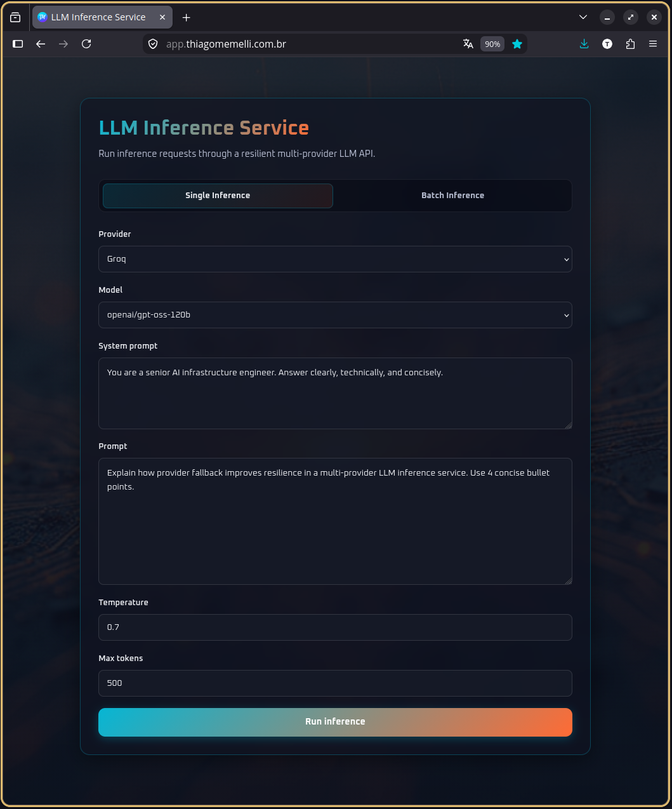
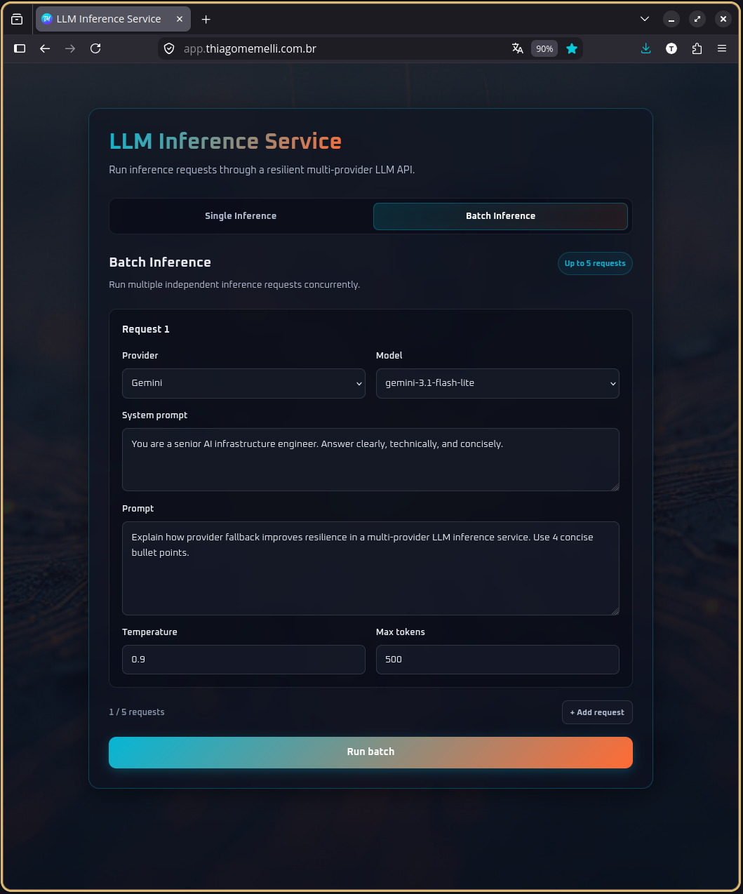
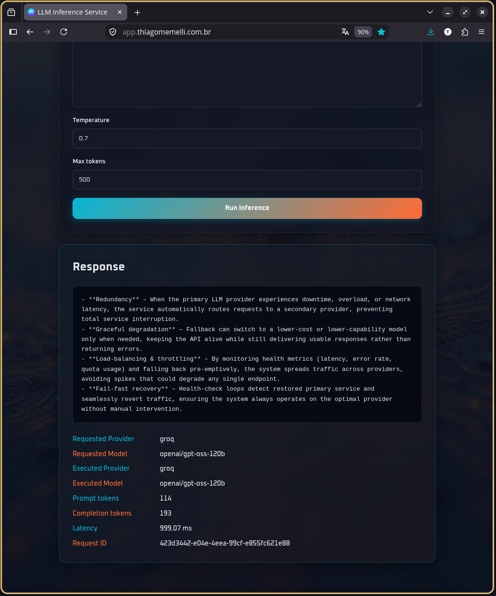
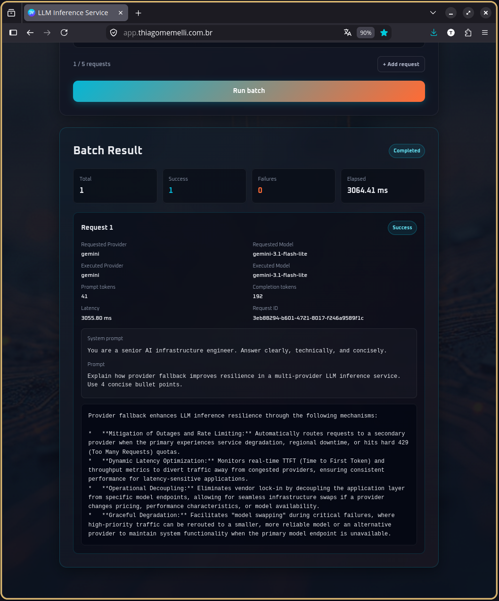
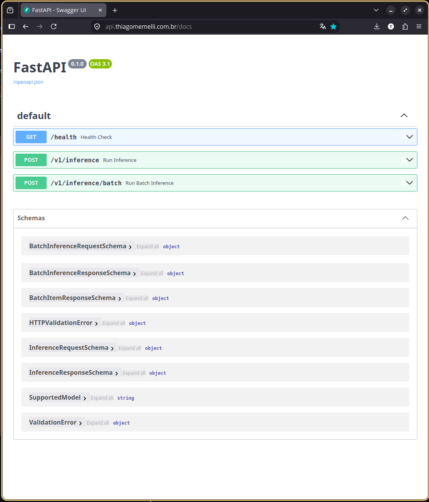

<div align="center">

# ⚡ LLM Inference Service

### API Resiliente de Inferência LLM Multi-Provider com Python Assíncrono, Execução Batch Concorrente, Roteamento de Fallback e Deploy em Produção

<div align="center">

🌍 **Language / Idioma**

[🇺🇸 English](./README.md) | 🇧🇷 **Português**

</div>

<br>


<br>

**Um serviço de inferência LLM orientado a produção que expõe APIs estáveis para inferência single e batch em múltiplos provedores de IA, centralizando resiliência, orquestração concorrente, validação, rate limiting e tratamento de erros específicos de cada provedor.**

### 🌐 Online

[**Aplicação Online**](https://app.thiagomemelli.com.br) •
[**Documentação da API**](https://api.thiagomemelli.com.br/docs) •
[**Health Check**](https://api.thiagomemelli.com.br/health) •
[**Portfólio**](https://thiagomemelli.com.br)

<br>

[Por que este projeto existe](#-por-que-este-projeto-existe) •
[Demo](#️-demo-online) •
[Funcionalidades](#-funcionalidades) •
[Arquitetura](#️-arquitetura) •
[API](#-api) •
[Início Rápido](#-início-rápido) •
[Testes](#-testes--qualidade) •
[Decisões de Engenharia](#-decisões-de-engenharia)

</div>

---

## 💡 Por que este projeto existe

Chamar diretamente um provedor de LLM é fácil. Operar de forma confiável uma aplicação que depende de LLMs é um problema diferente.

Quando uma aplicação passa a depender de provedores externos de modelos, ela precisa lidar com questões como:

- falhas transitórias de rede;
- timeouts do provedor;
- rate limits do upstream;
- indisponibilidade temporária de provedores;
- falhas no nível do modelo;
- falhas no nível do provedor;
- exceções específicas dos SDKs dos provedores;
- pressão de concorrência;
- validação de requisições;
- abuso de API pública;
- observabilidade entre retries e fallbacks.

Se essas responsabilidades ficam espalhadas entre handlers de endpoints ou chamadas diretas aos SDKs dos provedores, a aplicação rapidamente se torna difícil de compreender e de evoluir.

O **LLM Inference Service** centraliza esse comportamento atrás de uma única API HTTP assíncrona.

A API aceita tanto uma única requisição de inferência quanto um batch limitado de requisições independentes. A partir daí, o serviço assume a política de execução: orquestração concorrente, limites de concorrência por provedor, aplicação de timeout, retries, model fallback, provider fallback, normalização de erros e metadados de resposta.

---

## 🚀 O que ele faz

Os clientes podem executar uma única requisição de inferência ou um batch limitado de requisições independentes pelo mesmo backend agnóstico de provedor.

```text
POST /v1/inference
        │
        ▼
┌──────────────────────┐
│ Camada HTTP FastAPI  │
│ • validação schema   │
│ • limite por cliente │
└──────────┬───────────┘
           │
           ▼
┌──────────────────────┐
│  InferenceService    │
│  orquestração        │
└──────────┬───────────┘
           │
           ├── semaphore do provedor
           ├── timeout
           ├── retry + backoff + jitter
           ├── model fallback
           └── provider fallback
           │
           ▼
┌──────────────────────┐
│  ProviderRegistry    │
└──────────┬───────────┘
           │
     ┌─────┴─────┐
     ▼           ▼
┌─────────┐  ┌─────────┐
│  Groq   │  │ Gemini  │
│ Adapter │  │ Adapter │
└────┬────┘  └────┬────┘
     │            │
     ▼            ▼
 API Groq     Google GenAI
```

A execução batch reutiliza o mesmo pipeline de inferência em vez de criar um segundo caminho para os provedores:

```text
POST /v1/inference/batch
        │
        ▼
┌────────────────────────┐
│ BatchInferenceService  │
│ • limite configurável  │
│ • métricas agregadas   │
└───────────┬────────────┘
            │
            ▼
      asyncio.gather
            │
      ┌─────┼─────┐
      ▼     ▼     ▼
    item 1 item 2 item N
      │     │     │
      └─────┼─────┘
            ▼
    InferenceService
       por item
            │
            ▼
 retries / fallbacks /
 semaphores / timeouts
            │
            ▼
┌────────────────────────┐
│ BatchInferenceResult   │
│ • total                │
│ • success_count        │
│ • failure_count        │
│ • elapsed_ms           │
└────────────────────────┘
```

O `asyncio.gather()` coordena os itens do batch de forma concorrente, enquanto os semáforos já existentes por provedor continuam controlando a quantidade de chamadas upstream ativas. Assim, cada item mantém o mesmo comportamento de retry, fallback, timeout, rastreamento e tratamento de erros de provedor de uma inferência single normal.

Os detalhes dos SDKs dos provedores permanecem isolados atrás de adapters que implementam o mesmo contrato assíncrono de domínio.

---

## 🖼️ Demo Online

O projeto inclui um frontend público conectado ao serviço FastAPI em produção, com interfaces separadas para inferência single e batch.

<div align="center">

| Inferência Single | Inferência Batch |
|:---:|:---:|
|  |  |
| *Interface para uma única requisição em `app.thiagomemelli.com.br`* | *Interface batch para até 5 requisições independentes* |

| Resultado Single | Resultado Batch |
|:---:|:---:|
|  |  |
| *Resposta normalizada com provedor, modelo, uso de tokens, latência e request ID* | *Resultados por item mais métricas de total, sucessos, falhas e tempo decorrido* |

### Swagger / OpenAPI



*Documentação pública da API expondo `POST /v1/inference` e `POST /v1/inference/batch`.*

</div>

### Provedor/modelo solicitado vs. executado

O frontend mantém o provedor/modelo originalmente solicitado e os compara com o provedor/modelo retornado pela API.

Isso torna o model fallback e o provider fallback observáveis em vez de ocultos:

```text
Provedor solicitado: Gemini
Modelo solicitado:    gemini-3.1-flash-lite

Provedor executado:    Groq
Modelo executado:      openai/gpt-oss-20b
```

A mesma distinção está disponível nos resultados batch para cada item executado com sucesso.

---

## ✨ Funcionalidades

### 🔌 Inferência multi-provider

O serviço atualmente oferece suporte a dois provedores de LLM por meio de um único contrato de domínio:

| Provedor | Modelos Suportados |
|---|---|
| **Groq** | `openai/gpt-oss-20b`, `openai/gpt-oss-120b` |
| **Gemini** | `gemini-3.1-flash-lite` |

O código específico dos SDKs dos provedores fica isolado dentro de adapters dedicados.

### ⚡ Fluxo de requisição totalmente assíncrono

A API, os adapters dos provedores, o rate limiter e o fluxo de orquestração são assíncronos.

A integração com Groq usa `AsyncGroq`, enquanto a inferência Gemini usa o cliente assíncrono do Google GenAI.

### 📦 Inferência batch concorrente

`POST /v1/inference/batch` aceita múltiplas requisições independentes de inferência e as coordena por meio do `BatchInferenceService`.

O fluxo batch:

- distribui as requisições com `asyncio.gather()`;
- preserva a ordem entre entrada e saída;
- reutiliza `InferenceService` para cada item;
- isola falhas `ProviderError` no item afetado em vez de abortar o batch inteiro;
- retorna dados de sucesso/erro por item, além das métricas agregadas do batch;
- mantém os semáforos já existentes dos provedores no controle da concorrência real upstream.

O schema externo da API aceita entre 1 e 50 itens, enquanto o limite de runtime é configurável de forma independente por `BATCH_MAX_REQUESTS`. O deploy público atualmente utiliza no máximo **5 requisições por batch**.

### 🔁 Política de retry centralizada

O comportamento de retry é controlado pelo serviço em vez de ser delegado de forma independente para cada SDK.

Somente falhas transitórias do provedor são repetidas:

- timeout;
- falha de conexão;
- rate limit upstream;
- indisponibilidade temporária do provedor.

O intervalo de retry usa exponential backoff com jitter:

```text
delay = min(max_delay, base_delay × 2^attempt) + random_jitter
```

Isso reduz rajadas sincronizadas de retry enquanto mantém o comportamento configurável por provedor.

### ⏱️ Timeout por requisição

Cada tentativa de execução em um provedor passa por `asyncio.wait_for`, usando o timeout definido na política daquele provedor.

Um timeout é traduzido para o `ProviderTimeoutError` do próprio serviço, em vez de deixar uma exceção do SDK ou do asyncio escapar pela aplicação.

### 🔄 Model fallback

Um provedor pode definir modelos de fallback ordenados.

Com a configuração padrão de exemplo, o Groq pode alternar entre:

```text
openai/gpt-oss-20b
        │
        ▼
openai/gpt-oss-120b
```

e também no sentido inverso, quando configurado.

O model fallback ocorre depois que falhas passíveis de retry esgotam a política de retry do modelo solicitado.

### 🌐 Provider fallback

Se o fluxo do provedor original falhar, o serviço pode rotear a mesma requisição lógica para outro provedor.

A política de exemplo oferece suporte aos dois sentidos:

```text
Groq   ─────► Gemini
Gemini ─────► Groq
```

As requisições de fallback preservam o `request_id` original, permitindo que uma única requisição lógica permaneça rastreável mesmo quando o caminho de execução muda.

### 🛑 Proteção contra ciclos de provider fallback

O provider fallback é intencionalmente não recursivo.

Um provedor de fallback executa seu próprio fluxo, mas não inicia recursivamente outra cadeia de provider fallback. Isso impede que configurações como:

```text
Groq → Gemini → Groq → Gemini → ...
```

criem um loop infinito de roteamento.

Esse comportamento é explicitamente coberto por testes automatizados a partir dos dois provedores iniciais.

### 🚦 Controle de concorrência por provedor

Cada provedor recebe seu próprio `asyncio.Semaphore` durante a inicialização da aplicação.

Os limites de concorrência são configurados de forma independente:

```text
Groq   → max_concurrent_requests
Gemini → max_concurrent_requests
```

Dessa forma, um provedor lento ou muito utilizado não precisa compartilhar o mesmo teto de concorrência de outro provedor.

### 🧯 Rate limiting da API pública

Os dois endpoints de inferência são protegidos pelo mesmo rate limiter assíncrono em memória, baseado em janela móvel:

```text
POST /v1/inference
POST /v1/inference/batch
```

A configuração padrão de exemplo limita cada cliente a:

```text
5 requisições HTTP de inferência / minuto
```

Os clientes são identificados pelo endereço IP. Quando o serviço roda atrás de um reverse proxy confiável, o primeiro endereço presente em `X-Forwarded-For` é usado como endereço original do cliente.

O tamanho do batch é controlado separadamente por `BATCH_MAX_REQUESTS`.

> **Decisão arquitetural:** um batch conta como uma única requisição HTTP independentemente da quantidade de itens de inferência que contém. Isso é intencional na versão atual para manter a orquestração batch independente de uma lógica de quota ponderada. Uma versão futura poderia aplicar rate limiting ponderado, no qual cada item do batch contribuiria individualmente para a quota do cliente.

### 🧩 Registro de provedores

`ProviderRegistry` resolve por nome os clientes de provedores configurados.

O serviço de orquestração depende do protocolo `ProviderClient`, em vez de classes concretas dos SDKs dos provedores.

### 🛡️ Normalização de erros de provedor

Groq e Gemini expõem modelos de exceção diferentes. Cada adapter traduz falhas do SDK/transporte para uma hierarquia de domínio estável:

```text
ProviderError
├── ProviderAccessError
├── ProviderRequestRejectedError
├── ProviderRateLimitError
├── ProviderConnectionError
├── ProviderTimeoutError
├── ProviderUnavailableError
└── ProviderResponseError
```

Assim, o código da aplicação trabalha com falhas independentes de provedor.

### ✅ Validação rigorosa da API

O modelo público de requisição valida:

- nomes de provedores;
- compatibilidade entre provedor ↔ modelo;
- tamanho do prompt;
- tamanho do system prompt;
- faixa de temperatura;
- limite máximo de tokens.

Limites atuais das requisições:

| Campo | Restrição |
|---|---|
| `provider` | `groq` ou `gemini` |
| `prompt` | 1–2000 caracteres |
| `system_prompt` | opcional, 1–2000 caracteres |
| `temperature` | `0.0`–`2.0` |
| `max_tokens` | `1`–`500` |
| `requests` do batch | 1–50 no limite do schema da API |

O limite configurado de runtime do batch é validado separadamente por `BATCH_MAX_REQUESTS` e tem valor padrão `5`.

### 🆔 Rastreamento de requisições

Cada requisição de domínio recebe um UUID `request_id`.

Esse identificador é preservado entre retries, mudanças de modelo e provider fallback, e é retornado ao cliente da API.

### 📊 Metadados de inferência

Respostas single executadas com sucesso expõem:

- provedor executado;
- modelo executado;
- conteúdo gerado;
- quantidade de tokens do prompt;
- quantidade de tokens da conclusão;
- latência de inferência do provedor;
- request ID.

Respostas batch também expõem:

- resultados ordenados por item;
- estado de sucesso/falha por item;
- tipo e mensagem de erro isolados para itens que falharam;
- quantidade total de itens;
- quantidade de sucessos;
- quantidade de falhas;
- tempo total decorrido do batch.

---

## 🛡️ Estratégia de Resiliência

O caminho da inferência é deliberadamente ordenado.

```text
Requisição original
      │
      ▼
Provedor solicitado
      │
      ▼
Modelo solicitado
      │
      ├── tentativa
      ├── retry em falha transitória
      │
      ▼
Model fallback(s)
      │
      ├── tentativa
      ├── retry em falha transitória
      │
      ▼
Provider fallback
      │
      ▼
Fluxo do provedor de fallback
      │
      ▼
Sucesso ou falha normalizada
```

Para uma única tentativa em um provedor, a ordem de execução é:

```text
Aquisição do semaphore
        ↓
Limite de timeout
        ↓
Adapter do provedor
        ↓
SDK do provedor
        ↓
ModelResponse normalizado
```

Requisições batch adicionam uma camada de orquestração acima do fluxo existente de requisição single:

```text
BatchInferenceService
        ↓
  asyncio.gather
        ↓
InferenceService × N
        ↓
retry / fallback / timeout / semaphore por item
        ↓
valores BatchItemResult ordenados
        ↓
BatchInferenceResult
```

Essa separação mantém concorrência, timeout, retry e fallback na camada de orquestração, em vez de duplicar código de resiliência dentro de cada adapter de SDK.

---
## 🏗️ Arquitetura

```text
llm-inference-service/
│
├── assets/
│   ├── app-home.png
│   ├── batch-inference-home.png
│   ├── batch-success.png
│   ├── single-success.png
│   └── swagger-api.png
│
├── frontend/
│   ├── assets/
│   ├── app.js
│   ├── index.html
│   └── styles.css
│
├── src/
│   └── llm_inference_service/
│       │
│       ├── api/
│       │   ├── dependencies.py
│       │   ├── exception_handlers.py
│       │   ├── rate_limiter.py
│       │   ├── routes.py
│       │   └── schemas.py
│       │
│       ├── core/
│       │   ├── lifespan.py
│       │   ├── provider_policy.py
│       │   └── settings.py
│       │
│       ├── domain/
│       │   ├── exceptions.py
│       │   ├── models.py
│       │   ├── protocols.py
│       │   └── provider_catalog.py
│       │
│       ├── providers/
│       │   ├── gemini_client.py
│       │   └── groq_client.py
│       │
│       ├── services/
│       │   ├── batch_inference_service.py
│       │   ├── inference_service.py
│       │   └── provider_registry.py
│       │
│       └── main.py
│
├── tests/
│   ├── test_batch_models.py
│   ├── test_batch_route.py
│   ├── test_dependencies.py
│   ├── test_exception_handlers.py
│   ├── test_model_fallback.py
│   ├── test_provider_fallback.py
│   ├── test_rate_limiter.py
│   ├── test_retry_failed.py
│   ├── test_retry_success.py
│   ├── test_schemas.py
│   ├── test_semaphore.py
│   ├── test_settings.py
│   └── test_timeout.py
│
├── .env.example
├── .gitignore
├── pyproject.toml
├── uv.lock
├── README.md
└── README.pt-BR.md
```

### Responsabilidades das camadas

| Camada | Responsabilidade |
|---|---|
| `domain` | Modelos estáveis de requisição/resposta, contrato de provedor, catálogo de modelos suportados e exceções de domínio |
| `providers` | Adapters dos SDKs Groq e Gemini, além da tradução de erros específicos de provedor |
| `services` | Orquestração de inferência single, coordenação concorrente de batch, retry, fallback, timeout, uso de semáforos e resolução de provedores |
| `core` | Settings, políticas de provedores, validação de startup e composição de dependências no lifespan |
| `api` | Schemas HTTP, rotas, dependências, rate limiting público e mapeamento de exceções para HTTP |
| `frontend` | Cliente estático público para demonstrar inferência single e batch |

---

## 🔍 Componentes Principais

### `InferenceRequest`

Requisição imutável de domínio:

```python
@dataclass(frozen=True)
class InferenceRequest:
    provider: str
    model: str
    prompt: str
    temperature: float
    max_tokens: int
    system_prompt: str | None = None
    request_id: str = field(default_factory=lambda: str(uuid4()))
```

O `request_id` gerado permanece inalterado quando `dataclasses.replace()` cria requisições de model/provider fallback.

### `ModelResponse`

Resposta normalizada do provedor:

```python
@dataclass(frozen=True)
class ModelResponse:
    provider: str
    model: str
    content: str
    prompt_tokens: int
    completion_tokens: int
    latency_ms: float
    request_id: str
```

### `BatchItemResult` e `BatchInferenceResult`

A execução batch usa modelos de domínio imutáveis para manter cada item internamente consistente e validar as métricas agregadas:

```python
@dataclass(frozen=True)
class BatchItemResult:
    request_id: str
    success: bool
    response: ModelResponse | None
    error_type: str | None
    error_message: str | None


@dataclass(frozen=True)
class BatchInferenceResult:
    results: tuple[BatchItemResult, ...]
    total: int
    success_count: int
    failure_count: int
    elapsed_ms: float
```

Um item bem-sucedido deve conter um `ModelResponse` e nenhum campo de erro. Um item com falha deve conter metadados de erro e nenhuma resposta de modelo.

### `ProviderClient`

Contrato estrutural independente de provedor:

```python
class ProviderClient(Protocol):
    async def execute(
        self,
        request: InferenceRequest,
    ) -> ModelResponse:
        ...
```

Nem `InferenceService` nem a camada de domínio precisam herdar de classes do Groq ou Gemini.

### `ProviderPolicy`

Cada provedor possui seu próprio comportamento operacional:

```python
class ProviderPolicy(BaseModel):
    max_concurrent_requests: int
    timeout_seconds: float
    max_inference_retries: int
    retry_base_delay_seconds: float
    retry_max_exponential_delay_seconds: float
    retry_max_jitter_seconds: float
    model_fallbacks: dict[str, list[str]]
    provider_fallbacks: list[ProviderFallback]
```

As políticas são validadas no startup, incluindo compatibilidade provedor/modelo e relações inválidas de fallback.

### `ProviderRegistry`

O registry mantém a resolução de provedores fora do fluxo de orquestração:

```text
"groq"   ──► GroqClient
"gemini" ──► GeminiClient
```

### `InferenceService`

O orquestrador da aplicação é responsável por:

- resolver a política do provedor;
- adquirir o semaphore correto do provedor;
- aplicar timeout;
- repetir falhas transitórias;
- calcular exponential backoff e jitter;
- executar model fallback;
- executar provider fallback;
- preservar o request ID original.

### `BatchInferenceService`

O orquestrador batch é intencionalmente enxuto e delega cada item ao `InferenceService`.

Suas responsabilidades são:

- aplicar o limite configurado de tamanho do batch em runtime;
- distribuir requisições independentes com `asyncio.gather()`;
- preservar a ordem dos resultados;
- isolar falhas de provedor por item;
- calcular totais de itens/sucessos/falhas;
- medir o tempo total decorrido do batch.

### Composição do lifespan do FastAPI

Dependências de longa duração são criadas uma única vez durante o startup da aplicação:

```text
Settings
   │
   ├── Groq SDK ─────► GroqClient
   ├── Gemini SDK ───► GeminiClient
   │
   ├── Semáforos por Provedor
   ├── ProviderRegistry
   ├── InMemoryRateLimiter
   │
   └── InferenceService
            │
            ├──► BatchInferenceService
            │
            ▼
        app.state
```

Os clientes dos provedores são fechados durante o shutdown da aplicação.

---

## 🛠️ Stack Tecnológica

| Área | Tecnologia | Finalidade |
|---|---|---|
| Linguagem | Python 3.12+ | Implementação principal |
| API HTTP | FastAPI | Rotas assíncronas, injeção de dependências e OpenAPI |
| Validação | Pydantic | Schemas públicos de requisição/resposta e políticas de provedores |
| Configuração | pydantic-settings | Configuração baseada em variáveis de ambiente |
| Groq | `groq` / `AsyncGroq` | Inferência assíncrona com modelos Groq |
| Gemini | `google-genai` | Inferência assíncrona com modelos Gemini |
| Runtime assíncrono | `asyncio` | `gather` para batch, timeouts, semáforos, sleeps e locks |
| Contrato de provedor | `typing.Protocol` | Interface estrutural agnóstica de provedor |
| DTOs de domínio | dataclasses frozen | Objetos internos imutáveis de requisição/resposta |
| Testes | pytest + AnyIO | Testes assíncronos unitários e de orquestração |
| Verificação de tipos | mypy | Validação estática de tipos |
| Linting | Ruff | Qualidade de código |
| Gerenciador de pacotes | uv | Dependências e gerenciamento de ambiente |
| Frontend | HTML, CSS, JavaScript | Demonstração pública interativa |

---

## 🌐 API

### `GET /health`

Endpoint simples de verificação da saúde do serviço.

```bash
curl https://api.thiagomemelli.com.br/health
```

Resposta:

```json
{
  "status": "ok"
}
```

### `POST /v1/inference`

Executa uma inferência pelo provedor/modelo solicitado e pela política de resiliência configurada.

#### Exemplo com Groq

```bash
curl -X POST \
  https://api.thiagomemelli.com.br/v1/inference \
  -H 'Content-Type: application/json' \
  -d '{
    "provider": "groq",
    "model": "openai/gpt-oss-120b",
    "system_prompt": "Você é um assistente conciso de engenharia de IA.",
    "prompt": "Explique provider fallback em três tópicos.",
    "temperature": 0.7,
    "max_tokens": 300
  }'
```

#### Exemplo com Gemini

```bash
curl -X POST \
  https://api.thiagomemelli.com.br/v1/inference \
  -H 'Content-Type: application/json' \
  -d '{
    "provider": "gemini",
    "model": "gemini-3.1-flash-lite",
    "prompt": "Explique exponential backoff em termos simples.",
    "temperature": 0.7,
    "max_tokens": 300
  }'
```

#### Formato da resposta

```json
{
  "request_id": "d0780b5d-6d7b-4dca-8689-b255449ec65f",
  "provider": "groq",
  "model": "openai/gpt-oss-120b",
  "content": "...",
  "prompt_tokens": 123,
  "completion_tokens": 266,
  "latency_ms": 1074.57
}
```

> A resposta informa o provedor e o modelo que realmente executaram a inferência. Isso é importante quando model fallback ou provider fallback alteram o caminho de execução.

### `POST /v1/inference/batch`

Executa múltiplas requisições independentes de inferência pelo mesmo pipeline de resiliência e retorna resultados ordenados por item.

#### Exemplo batch

```bash
curl -X POST \
  https://api.thiagomemelli.com.br/v1/inference/batch \
  -H 'Content-Type: application/json' \
  -d '{
    "requests": [
      {
        "provider": "groq",
        "model": "openai/gpt-oss-120b",
        "system_prompt": "Você é um assistente conciso de engenharia de IA.",
        "prompt": "Explique provider fallback em três tópicos.",
        "temperature": 0.7,
        "max_tokens": 300
      },
      {
        "provider": "gemini",
        "model": "gemini-3.1-flash-lite",
        "prompt": "Explique exponential backoff em termos simples.",
        "temperature": 0.7,
        "max_tokens": 300
      }
    ]
  }'
```

#### Formato da resposta batch

```json
{
  "results": [
    {
      "request_id": "request-1",
      "success": true,
      "response": {
        "request_id": "request-1",
        "provider": "groq",
        "model": "openai/gpt-oss-120b",
        "content": "...",
        "prompt_tokens": 42,
        "completion_tokens": 120,
        "latency_ms": 1080.25
      },
      "error_type": null,
      "error_message": null
    },
    {
      "request_id": "request-2",
      "success": false,
      "response": null,
      "error_type": "ProviderRequestRejectedError",
      "error_message": "O provedor upstream rejeitou a requisição."
    }
  ],
  "total": 2,
  "success_count": 1,
  "failure_count": 1,
  "elapsed_ms": 1120.44
}
```

Falhas de provedor ficam isoladas ao item correspondente do batch. Os demais itens ainda podem concluir com sucesso.

### Mapeamento de erros HTTP

Falhas de domínio relacionadas aos provedores são traduzidas para respostas HTTP estáveis:

| Falha | Status HTTP |
|---|---:|
| Provedor desconhecido | `400 Bad Request` |
| Limite configurado do tamanho do batch excedido | `400 Bad Request` |
| Rate limit público de inferência | `429 Too Many Requests` |
| Falha de acesso/autenticação do provedor | `502 Bad Gateway` |
| Requisição rejeitada pelo provedor | `502 Bad Gateway` |
| Falha de conexão com o provedor | `502 Bad Gateway` |
| Resposta inválida do provedor | `502 Bad Gateway` |
| Falha genérica do provedor | `502 Bad Gateway` |
| Rate limit do provedor upstream | `503 Service Unavailable` |
| Provedor temporariamente indisponível | `503 Service Unavailable` |
| Timeout do provedor | `504 Gateway Timeout` |

Erros de validação do FastAPI/Pydantic usam a resposta padrão de validação do framework.

---
## 📦 Início Rápido

### Pré-requisitos

- Python 3.12+
- `uv`
- chave de API Groq
- chave de API Gemini

### 1. Clone o repositório

```bash
git clone https://github.com/tmemelli/llm-inference-service.git
cd llm-inference-service
```

### 2. Instale as dependências

```bash
uv sync
```

### 3. Configure as variáveis de ambiente

```bash
cp .env.example .env
```

Depois, substitua as chaves de exemplo dos provedores no `.env`:

```env
GROQ_API_KEY=your_groq_api_key_here
GEMINI_API_KEY=your_gemini_api_key_here
```

O arquivo de exemplo também contém:

- origens CORS permitidas;
- rate limit da API de inferência;
- limite de tamanho do batch (`BATCH_MAX_REQUESTS`);
- limites de concorrência específicos por provedor;
- configurações de timeout;
- configuração de retry/backoff/jitter;
- mapeamentos de model fallback;
- mapeamentos de provider fallback.

> Nunca faça commit de um arquivo `.env` real. O `.gitignore` do repositório exclui arquivos de ambiente e permite explicitamente apenas `.env.example`.

### 4. Execute a API

```bash
uv run uvicorn llm_inference_service.main:app --reload
```

Endpoints locais:

```text
API:               http://127.0.0.1:8000
Swagger:           http://127.0.0.1:8000/docs
Health:            http://127.0.0.1:8000/health
Inferência single: http://127.0.0.1:8000/v1/inference
Inferência batch:  http://127.0.0.1:8000/v1/inference/batch
```

### 5. Opcional: sirva o frontend localmente

```bash
cd frontend
python -m http.server 5500
```

Abra:

```text
http://localhost:5500
```

O frontend usa automaticamente `http://127.0.0.1:8000` quando é servido a partir de `localhost`/`127.0.0.1`, e `https://api.thiagomemelli.com.br` em produção.

---

## ⚙️ Configuração das Políticas de Provedor

A resiliência dos provedores é orientada por configuração, em vez de ficar hard-coded no serviço.

A execução batch possui seu próprio limite independente de runtime:

```env
BATCH_MAX_REQUESTS=5
```

O `.env.example` também inclui políticas de provedores equivalentes a:

```text
Groq
├── máximo de requisições concorrentes: 5
├── timeout: 15s
├── retries de inferência: 1
├── delay base de retry: 0.5s
├── delay exponencial máximo: 2.0s
├── jitter máximo: 0.05s
├── model fallback
│   ├── 20B  → 120B
│   └── 120B → 20B
└── provider fallback
    └── Gemini / gemini-3.1-flash-lite

Gemini
├── máximo de requisições concorrentes: 2
├── timeout: 15s
├── retries de inferência: 1
├── delay base de retry: 0.5s
├── delay exponencial máximo: 2.0s
├── jitter máximo: 0.05s
├── model fallback: nenhum
└── provider fallback
    └── Groq / openai/gpt-oss-120b
```

A validação no startup rejeita configurações inválidas, como:

- provedores não suportados;
- políticas ausentes para provedores;
- nomes de modelos inválidos;
- model fallback para o próprio modelo;
- model fallback apontando para o provedor incorreto;
- alvos duplicados de model fallback;
- provider fallback para o próprio provedor;
- provedores de fallback não suportados;
- incompatibilidade entre provedor e modelo;
- alvos duplicados de provider fallback.

Isso detecta erros de roteamento antes que a API comece a aceitar tráfego.

---

## 🧪 Testes & Qualidade

O projeto contém **62 casos de teste automatizados**, cobrindo resiliência de requisições single, orquestração concorrente de batch, comportamento da API, configuração e invariantes de domínio.

Execute a suíte:

```bash
uv run pytest -v
```

### A cobertura de testes inclui

- compatibilidade de schema entre provedor/modelo;
- normalização do provedor;
- carregamento de settings e validação das políticas no startup;
- retry bem-sucedido após uma falha transitória do provedor;
- falha após esgotamento dos retries;
- tradução de timeout;
- sucesso de model fallback;
- esgotamento de model fallback;
- sucesso de provider fallback;
- falha de provider fallback;
- comportamento com provider fallback desabilitado;
- provider fallback após falha não passível de retry no provedor original;
- prevenção de loop Groq → Gemini;
- prevenção de loop Gemini → Groq;
- limitação de concorrência por semaphore de provedor;
- rate limiting por cliente;
- resolução de IP encaminhado/IP do cliente;
- mapeamento de exceções para respostas HTTP;
- execução concorrente de múltiplos itens de batch;
- isolamento de falha de provedor por item;
- aplicação do limite configurado de tamanho do batch;
- validação de invariantes de domínio do batch;
- sucesso e comportamento de validação do endpoint batch;
- rejeição pela API de batches acima do máximo definido no schema.

### Verificação estática de tipos

```bash
uv run mypy src tests
```

O projeto configura o plugin Pydantic para mypy, permitindo validação tipada dos modelos.

### Linting

```bash
uv run ruff check .
```

---

## 🧠 Decisões de Engenharia

### Por que usar um `Protocol` para os provedores?

A camada de orquestração depende de comportamento, e não de uma hierarquia de herança ou de um SDK específico.

```python
class ProviderClient(Protocol):
    async def execute(self, request: InferenceRequest) -> ModelResponse:
        ...
```

Qualquer adapter de provedor que satisfaça esse contrato pode ser registrado sem alterar a interface principal do serviço de inferência.

### Por que usar Pydantic na fronteira da API e dataclasses no domínio?

Eles resolvem problemas diferentes.

**Pydantic** lida com entrada externa não confiável:

- coerção/normalização;
- restrições;
- compatibilidade entre provedor/modelo;
- schemas públicos de requisição/resposta.

**Dataclasses frozen** representam dados internos simples e imutáveis depois que a validação já ocorreu.

Isso mantém preocupações de validação HTTP fora do modelo de domínio.

### Por que centralizar retries em vez de usar os retries dos SDKs?

O SDK do Groq é configurado com `max_retries=0`, e o cliente Gemini é configurado para uma única tentativa no SDK.

A política de retry pertence ao `InferenceService`, onde pode ser coordenada com:

- timeout;
- model fallback;
- provider fallback;
- controle de concorrência.

Sem essa separação, retries do SDK e retries da aplicação poderiam se multiplicar entre si, tornando difícil prever a quantidade total de tentativas.

### Por que configurar resiliência por provedor?

Provedores podem ter características diferentes de latência, quotas e restrições de concorrência.

Um único timeout ou semaphore global obrigaria provedores independentes a compartilhar as mesmas premissas operacionais.

`ProviderPolicy` mantém esses limites independentes e configuráveis.

### Por que usar um semaphore por provedor?

O semaphore controla chamadas upstream de inferência ativas, e não o tráfego HTTP recebido pela aplicação de forma geral.

Isso permite que Groq tenha um teto de concorrência enquanto Gemini possui outro.

Ele protege os provedores upstream sem serializar desnecessariamente a API inteira.

### Por que o provider fallback não é recursivo?

Fallback bidirecional é útil:

```text
Groq → Gemini
Gemini → Groq
```

mas aplicar provider fallback de forma recursiva permitiria ciclos.

Por isso, o serviço executa provider fallback como uma etapa externa limitada, em vez de invocar recursivamente o ponto de entrada completo do fallback.

### Por que preservar o `request_id` entre fallbacks?

Uma troca de modelo/provedor ainda faz parte da mesma requisição lógica de inferência.

Alterar o identificador durante o fallback quebraria o rastreamento em nível de requisição e dificultaria correlacionar a resposta final com a chamada original.

### Por que normalizar exceções dos SDKs?

Groq e Gemini usam classes de erro e comportamentos de transporte diferentes.

Se essas exceções escapassem dos adapters, a camada de aplicação ficaria acoplada aos SDKs dos fornecedores.

Em vez disso:

```text
Erro SDK Groq   ─┐
                 ├──► hierarquia ProviderError ──► mapeamento HTTP
Erro SDK Gemini ─┘
```

Assim, a API consegue expor um comportamento estável mesmo quando os detalhes internos dos SDKs dos provedores são diferentes.

### Por que validar a configuração de fallback no startup?

Uma política de roteamento malformada deve falhar antes que o tráfego chegue ao serviço.

Exemplos como um modelo Gemini configurado sob Groq, um provedor fazendo fallback para si mesmo ou alvos duplicados de fallback são erros de configuração — não erros de inferência em runtime.

A validação fail-fast no startup torna esses erros explícitos.

### Por que um `BatchInferenceService` dedicado?

Orquestração batch é uma responsabilidade diferente da inferência em provedor.

`BatchInferenceService` coordena múltiplas requisições independentes, mas não duplica a lógica de retry, fallback, timeout, semaphore ou seleção de provedor. Cada item é delegado de volta ao `InferenceService` já existente.

Isso mantém a camada batch focada na orquestração fan-out/fan-in e na agregação, preservando uma única fonte de verdade para o comportamento de inferência.

### Por que usar `asyncio.gather()` na orquestração batch?

Os itens do batch são independentes, portanto podem ser agendados de forma concorrente.

`asyncio.gather()` fornece um modelo simples de fan-out/fan-in e preserva a ordem dos resultados. A concorrência real nos provedores continua limitada pelos semáforos específicos já existentes, então adicionar execução batch não ignora as proteções upstream.

### Por que um batch conta como uma única requisição HTTP no rate limit?

O rate limiter atual opera na fronteira da requisição HTTP.

Isso significa:

```text
POST /v1/inference       → 1 unidade de rate limit
POST /v1/inference/batch → 1 unidade de rate limit
```

O tamanho do batch é limitado de forma independente por `BATCH_MAX_REQUESTS`.

Isso é deliberado na versão atual: a funcionalidade batch demonstra orquestração concorrente e isolamento de falhas sem acoplar a camada batch a uma estratégia de quota ponderada. Rate limiting ponderado é uma extensão futura natural caso cada item de inferência deva consumir quota individualmente.

---

## 🔐 Segurança & Considerações sobre a API Pública

O deploy público mantém intencionalmente as credenciais dos provedores no backend.

### Proteções implementadas

- chaves de API dos provedores são carregadas a partir de variáveis de ambiente;
- as chaves usam `SecretStr` do Pydantic nos settings da aplicação;
- o frontend não contém credenciais Groq ou Gemini;
- arquivos `.env` são excluídos pelo `.gitignore`;
- origens CORS são configuradas explicitamente;
- métodos CORS permitidos são restritos a `GET` e `POST`;
- headers CORS permitidos são restritos a `Content-Type`;
- chamadas públicas de inferência possuem rate limit por cliente;
- limites de prompt e tokens restringem o tamanho das requisições;
- o tamanho do batch é limitado de forma independente por `BATCH_MAX_REQUESTS`;
- erros de provedores são traduzidos para mensagens controladas da API, em vez de expor exceções brutas dos SDKs.

### Observação sobre reverse proxy

A extração do IP do cliente confia no primeiro valor de `X-Forwarded-For` quando esse header está presente. Esse comportamento só é apropriado quando a aplicação está atrás de um proxy confiável que controla os headers encaminhados.

---

## 🚀 Deploy

A aplicação é publicada em superfícies públicas separadas:

```text
Internet
│
├── thiagomemelli.com.br
│   └── Portfólio profissional
│
├── app.thiagomemelli.com.br
│   └── Cliente estático HTML/CSS/JavaScript
│
└── api.thiagomemelli.com.br
    └── FastAPI
        ├── GET  /health
        ├── POST /v1/inference
        ├── POST /v1/inference/batch
        └── GET  /docs
              │
              ├── Groq
              └── Gemini
```

O navegador chama apenas o endpoint público do FastAPI:

```text
Navegador
   │
   ├── POST /v1/inference
   └── POST /v1/inference/batch
              │
              ▼
        Serviço FastAPI
   │
   ├── chave Groq somente no servidor
   └── chave Gemini somente no servidor
```

Os secrets dos provedores nunca precisam ser enviados ao frontend.

---

## 📌 Escopo Atual

Este repositório concentra-se em inferência LLM confiável com resposta única e batch limitado sobre um fluxo de execução HTTP assíncrono.

O escopo atual inclui:

- transporte público FastAPI;
- frontend estático público;
- integrações Groq e Gemini;
- validação do catálogo provedor/modelo;
- políticas específicas por provedor;
- execução assíncrona;
- orquestração batch concorrente com `asyncio.gather`;
- isolamento de falha por item no batch;
- aplicação de limite configurável de tamanho do batch;
- métricas agregadas de batch;
- timeouts;
- retry com exponential backoff e jitter;
- model fallback;
- provider fallback bidirecional;
- proteção contra loops de fallback;
- limites de concorrência por provedor;
- rate limiting da API por cliente;
- normalização de erros dos provedores;
- request IDs;
- metadados de tokens e latência;
- testes automatizados;
- configuração de verificação de tipos e linting;
- deploy online com domínios personalizados.

### Limitações atuais intencionais

O projeto **não** implementa atualmente:

- respostas em streaming;
- rate limiting distribuído;
- armazenamento persistente de telemetria;
- autenticação/contas;
- roteamento baseado em custo;
- circuit breakers;
- pontuação dinâmica da saúde dos provedores;
- schemas estruturados para a saída dos modelos.

O rate limiter em memória é intencionalmente simples e local ao processo. Um deploy com escala horizontal exigiria estado compartilhado para manter rate limits globalmente consistentes.

---

## 🗺️ Roadmap

### v0.1 — API Multi-Provider Resiliente ✅

- [x] Endpoint assíncrono de inferência com FastAPI
- [x] Integração com Groq
- [x] Integração com Gemini
- [x] Validação de compatibilidade provedor/modelo
- [x] Políticas de runtime específicas por provedor
- [x] Timeouts configuráveis
- [x] Retry com exponential backoff e jitter
- [x] Model fallback
- [x] Provider fallback bidirecional
- [x] Proteção contra ciclos de provider fallback
- [x] Semáforos por provedor
- [x] Rate limiting público por cliente
- [x] Normalização de erros dos provedores
- [x] Preservação de request ID entre fluxos de fallback
- [x] Metadados de tokens e latência
- [x] Mapeamento de exceções no FastAPI
- [x] Documentação pública Swagger/OpenAPI
- [x] Frontend público
- [x] Deploy com domínio personalizado
- [x] Suíte de testes automatizados
- [x] Configuração do mypy
- [x] Verificações com Ruff

### v0.2 — Inferência Batch Concorrente ✅

- [x] `POST /v1/inference/batch`
- [x] `BatchInferenceService`
- [x] Fan-out/fan-in concorrente com `asyncio.gather()`
- [x] Isolamento de falha de provedor por item
- [x] Preservação da ordem entrada/saída
- [x] Métricas agregadas de total/sucesso/falha/tempo decorrido
- [x] `BATCH_MAX_REQUESTS` configurável
- [x] Validação HTTP e tratamento de erros específicos do batch
- [x] Abas Single / Batch no frontend
- [x] Visibilidade do prompt e system prompt por item nos resultados batch
- [x] Testes de domínio e do endpoint HTTP batch

### Possíveis próximas iterações

- [ ] Rate limiting distribuído com Redis
- [ ] Rate limiting ponderado para itens de batch
- [ ] Integração OpenTelemetry / métricas persistentes
- [ ] Respostas de inferência em streaming
- [ ] Circuit breaker por provedor
- [ ] Roteamento baseado na saúde dos provedores
- [ ] Políticas de roteamento baseadas em custo
- [ ] Saídas estruturadas dos modelos
- [ ] Autenticação e API keys para consumidores
- [ ] Workflow de deploy containerizado
- [ ] Pipeline de CI para testes, mypy e Ruff

---

## 👨‍💻 Autor

**Thiago Memelli**  
Engenheiro de IA | Python | Sistemas LLM | Engenharia Backend

- GitHub: [@tmemelli](https://github.com/tmemelli)
- LinkedIn: [linkedin.com/in/thiagomemelli](https://www.linkedin.com/in/thiagomemelli)
- Portfólio: [thiagomemelli.com.br](https://thiagomemelli.com.br)
- Email: [tmemelli@gmail.com](mailto:tmemelli@gmail.com)

---

<div align="center">

**Construído como um projeto prático de Engenharia de IA focado em infraestrutura LLM confiável, Python assíncrono, orquestração concorrente, abstração de provedores, resiliência e deploy no mundo real.**

</div>
